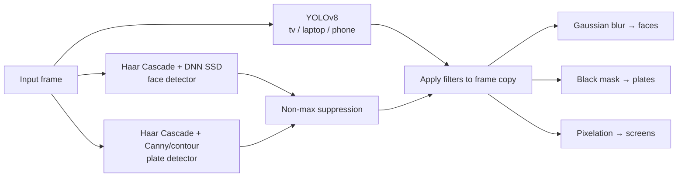

# Privacy Filter (Video)

> **Status: work in progress.** Phases 0 and 1 (audit, baseline, video streaming/tracking pipeline) are mostly done; Phase 2 onward (better detectors, click-to-select, profiles, packaging, hosted demo) is pending. See [`docs/HANDOFF.md`](docs/HANDOFF.md) for exactly what's done, what's measured, and what's still open, and [`docs/NEXT_PROMPTS.md`](docs/NEXT_PROMPTS.md) for ready-to-paste next steps.

A locally-run Python web app that finds sensitive visual information in **images and short videos** and anonymizes it automatically — no cloud APIs, no accounts, nothing ever leaves your machine.

It doesn't treat every detection the same way. It picks a filter based on *what* it found:

| Detected | Filter | Why |
|---|---|---|
| Human faces | Gaussian blur | Softens identity while keeping the photo looking natural, not like a redaction |
| License plates | Solid black mask | Plate text just needs to be unreadable — no need to preserve visual continuity |
| Screens / phones / laptops | Pixelation | Shows *there's a device* without leaking whatever's on the screen |

## How it works

Three independent detectors run **in parallel** (one `ThreadPoolExecutor`, three workers) on every frame:



- **Faces** are found two ways — a fast Haar Cascade and, if you drop the model files into `project/models/`, a more accurate DNN (SSD) detector — and the results are merged and deduplicated with non-max suppression.
- **Plates** likewise combine a Haar Cascade trained on plate shapes with classic contour detection (Canny edges → `findContours` → filter by aspect ratio), since neither alone catches everything.
- **Screens** use YOLOv8 (`yolov8n.pt`), filtered down to the `tv`/`laptop`/`cell phone` COCO classes.

All three run against the same frame at once, so total detection time is roughly the slowest single detector, not the sum of all three.

**Video** reuses the exact same per-frame pipeline (`process_frame()` in `detector.py`) — it just loops it over every frame of the clip with one shared thread pool, then re-encodes the result as MP4. Clips are capped at ~12 seconds and frames wider than 960px are downscaled, to keep processing time and page size reasonable for a demo app; there's no audio track in the output since OpenCV's video I/O is video-only.

Original files are never modified — every filter is applied to an in-memory copy, and uploaded/processed files are deleted from disk right after the response is sent.

## Results

**License plate → black mask**, run through `project/app.py`'s full pipeline:


**Face → blur, laptop → pixelation**, same image, two different filters chosen automatically by class:


**Crowd scene — 5 faces blurred**, and a useful example of a real failure mode: the solid black box on the sign in the background is a **false-positive plate detection** (a rectangular, high-contrast region the contour detector mistook for a plate). This is a known, documented limitation of the contour-based fallback, not a bug — see [Known Limitations](project/README.md#known-limitations).


## Baseline (Phase 0)

Before changing any detector, the current pipeline was measured against a fixed, seeded 300-image subset of the [WIDER FACE](http://shuoyang1213.me/WIDERFACE/) validation set (seed 42; 3,022 ground-truth face boxes), using `eval/prepare_wider_face.py` and `eval/run_baseline.py`. IoU threshold 0.5, per `CLAUDE.md`'s metric definitions. Full numbers: [`eval/results/baseline.csv`](eval/results/baseline.csv).

| Detector | Precision | Recall | Recall (small) | Recall (medium) | Recall (large) | FPS |
|---|--:|--:|--:|--:|--:|--:|
| Face — Haar cascade (current default) | 47.1% | 25.1% | 6.5% | 44.2% | 59.9% | 2.31 |
| Face — DNN (SSD) | 98.1% | 11.8% | 0.0% | 13.1% | 74.0% | 32.94 |
| Face — Haar+DNN (production `detect_faces`) | 49.8% | 27.2% | 6.5% | 46.0% | 74.0% | 2.18 |

Size buckets are by the longer side of the ground-truth box: small <32px, medium 32–96px, large >96px.

- **DNN alone is high-precision, low-recall** — 98.1% of its detections are correct, but it finds barely 1 in 10 ground-truth faces overall and **zero small faces** in this subset; it only earns its keep on large faces (74.0%). Haar catches more overall but with far more false positives (47.1% precision).
- **Combined (production) beats both on recall and precision simultaneously** — merging Haar+DNN with NMS lifts recall from 25.1% (Haar alone) to 27.2%, and precision from 47.1% to 49.8%, with large-face recall jumping to 74.0%. Small-face recall is unchanged at 6.5% — DNN contributes nothing there, so this remains the weak point Phase 2's detector comparison needs to beat, not "faster" or "looks better."
- **Plates and screens have no ground truth in WIDER FACE** (it's a face-only dataset), so only raw detection counts and FPS are reported, honestly, rather than a fabricated precision/recall: the current Haar+contour plate detector found 310 boxes across the 300 images at 5.26 FPS, and YOLOv8n found 8 screen-class boxes at 21.15 FPS. A labelled plate/screen set is Phase 2's job (`PHASES.md`).
- FPS above is **single-detector throughput** (one function, single-threaded, no I/O) on the hardware below — not the full three-detector parallel `process_frame()` pipeline end to end, and not comparable to a future video FPS number once tracking/streaming (Phase 1) changes the pipeline shape.
- The DNN model's weights have an undocumented upstream licence — see `project/README.md`'s DNN section before treating it as more than a local evaluation candidate.

**Hardware:** Apple M5, confirmed native arm64 (`platform.machine()` reports `arm64`, not `x86_64` under Rosetta) in the `.venv` interpreter, macOS 26.6.2, CPU only — no GPU used by any of these detectors. Python 3.12.5, opencv-python 4.14.0.94, ultralytics 8.4.161.

Reproduce with:
```bash
python -m venv .venv && source .venv/bin/activate
pip install -r project/requirements.txt -r eval/requirements.txt
python eval/prepare_wider_face.py   # downloads WIDER FACE val (~365MB, cached after first run)
python eval/run_baseline.py         # writes eval/results/baseline.csv
```

Known issues and fragile spots found while building this baseline (Flask debug mode exposed on `0.0.0.0`, non-H.264 video output, zero box padding before redaction, and more) are documented with file:line references in [`docs/AUDIT.md`](docs/AUDIT.md) — nothing was fixed yet, this phase only measures and records.

## Quick start

```bash
cd project
pip install -r requirements.txt
python app.py
```

Then open `http://127.0.0.1:5000`, upload an image or short video, and download the filtered result.

Full setup (including the optional DNN face model), architecture notes, and the complete list of known limitations live in **[project/README.md](project/README.md)**.

## Performance: environment variables

| Variable | Default | Effect |
|---|---|---|
| `MAX_CLIP_SECONDS` | unset (unlimited) | Caps how much of a clip is processed. |
| `DETECTION_STRIDE` | `1` (every frame) | Run detection every Kth frame; the tracker's gap-fill bridges the rest. See warning below. |
| `PRIVACY_PROFILE` | unset | Set to `journalist` to force `DETECTION_STRIDE=1` regardless of the setting above (a stopgap ahead of a real profile system — see `PHASES.md` Phase 4). |

**`DETECTION_STRIDE` trade-off — read before using it.** Face/plate detection is the dominant per-frame cost (measured: ~376ms and ~176ms/frame respectively on a real portrait clip, vs ~1ms for tracking and ~77ms for redaction — see `docs/HANDOFF.md` for the full profiling breakdown). Setting `DETECTION_STRIDE=K` runs the detectors every Kth frame instead of every frame, and lets the existing tracker gap-fill the skipped frames. This does **not** weaken the core guarantee that every raw detection is redacted the instant it's found — that guarantee only ever applies to frames detection actually runs on. What it does mean: **a face, plate, or screen that first appears on a skipped frame is not redacted until the next detection frame runs — up to (K-1) frames of exposure for something brand new.** An already-tracked object keeps being redacted via gap-fill in the meantime; a genuinely new one does not. This is why Journalist mode always forces K=1 — CLAUDE.md's non-negotiable #2 ("a missed detection is a failure") means recall is never traded for speed in that profile.

## Testing

```bash
python -m pytest tests/
```

Synthetic boxes and small sample/generated clips only, per `CLAUDE.md` — no large media files in the test suite.

**Known gap — rotation metadata:** phone-recorded portrait clips often carry a rotation hint in container metadata rather than physically rotated pixels. This machine's ffmpeg build (9.0.2) could not be made to write that metadata into a test fixture — five different documented methods (`-metadata rotate=`, remux-only, the `h264_metadata` bitstream filter as both a tag and an SEI option, and the `-rotate` encoder option) all failed or produced metadata `ffprobe` itself couldn't decode back out, on this build specifically. Phase 1's video pipeline (`project/core/video.py`) reads rotation via `ffprobe` and compensates with `cv2.rotate()` itself rather than trusting OpenCV's auto-orientation flags — its unit tests mock the ffprobe rotation value rather than depending on a real fixture this environment can't produce. There is no automated end-to-end test with a real rotated file: check real portrait phone clips manually before relying on this path.

## Repo layout

```
.
├── project/            ← the Flask app (see project/README.md)
├── docs/results/        ← before/after samples used above
├── images_CV_AAT/       ← sample test images
└── instructions.txt     ← original PRD / build spec
```


