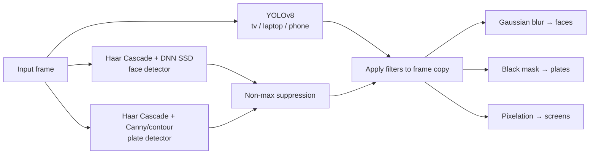

# Privacy Filter (Video)

A locally-run Python web app that finds sensitive visual information in **images and short videos** and anonymizes it automatically — no cloud APIs, no accounts, nothing ever leaves your machine.

It doesn't treat every detection the same way. It picks a filter based on *what* it found:

| Detected | Filter | Why |
|---|---|---|
| Human faces | Gaussian blur | Softens identity while keeping the photo looking natural, not like a redaction |
| License plates | Solid black mask | Plate text just needs to be unreadable — no need to preserve visual continuity |
| Screens / phones / laptops | Pixelation | Shows *there's a device* without leaking whatever's on the screen |

## How it works

Three independent detectors run **in parallel** (one `ThreadPoolExecutor`, three workers) on every frame:



- **Faces** are found two ways — a fast Haar Cascade and, if you drop the model files into `project/models/`, a more accurate DNN (SSD) detector — and the results are merged and deduplicated with non-max suppression.
- **Plates** likewise combine a Haar Cascade trained on plate shapes with classic contour detection (Canny edges → `findContours` → filter by aspect ratio), since neither alone catches everything.
- **Screens** use YOLOv8 (`yolov8n.pt`), filtered down to the `tv`/`laptop`/`cell phone` COCO classes.

All three run against the same frame at once, so total detection time is roughly the slowest single detector, not the sum of all three.

**Video** reuses the exact same per-frame pipeline (`process_frame()` in `detector.py`) — it just loops it over every frame of the clip with one shared thread pool, then re-encodes the result as MP4. Clips are capped at ~12 seconds and frames wider than 960px are downscaled, to keep processing time and page size reasonable for a demo app; there's no audio track in the output since OpenCV's video I/O is video-only.

Original files are never modified — every filter is applied to an in-memory copy, and uploaded/processed files are deleted from disk right after the response is sent.

## Results

**License plate → black mask**, run through `project/app.py`'s full pipeline:


**Face → blur, laptop → pixelation**, same image, two different filters chosen automatically by class:


**Crowd scene — 5 faces blurred**, and a useful example of a real failure mode: the solid black box on the sign in the background is a **false-positive plate detection** (a rectangular, high-contrast region the contour detector mistook for a plate). This is a known, documented limitation of the contour-based fallback, not a bug — see [Known Limitations](project/README.md#known-limitations).


## Baseline (Phase 0)

Before changing any detector, the current pipeline was measured against a fixed, seeded 300-image subset of the [WIDER FACE](http://shuoyang1213.me/WIDERFACE/) validation set (seed 42; 3,022 ground-truth face boxes), using `eval/prepare_wider_face.py` and `eval/run_baseline.py`. IoU threshold 0.5, per `CLAUDE.md`'s metric definitions. Full numbers: [`eval/results/baseline.csv`](eval/results/baseline.csv).

| Detector | Precision | Recall | Recall (small) | Recall (medium) | Recall (large) | FPS |
|---|--:|--:|--:|--:|--:|--:|
| Face — Haar cascade (current default) | 47.1% | 25.1% | 6.5% | 44.2% | 59.9% | 2.07 |
| Face — DNN (SSD) | — | — | — | — | — | — |
| Face — Haar+DNN (production `detect_faces`) | 47.1% | 25.1% | 6.5% | 44.2% | 59.9% | 2.07 |

Size buckets are by the longer side of the ground-truth box: small <32px, medium 32–96px, large >96px.

- **DNN row is blank because `project/models/*.caffemodel` isn't present in this environment** — the app already handles this gracefully (falls back to Haar-only, see `project/README.md`'s optional download step), so the production row above is currently identical to the Haar-only row, not a stronger combined result.
- **Recall on small faces (6.5%) is the standout weak point** — the Haar cascade is missing roughly 19 out of 20 small faces in this subset. This is the number Phase 2's detector comparison needs to beat, not "faster" or "looks better."
- **Plates and screens have no ground truth in WIDER FACE** (it's a face-only dataset), so only raw detection counts and FPS are reported, honestly, rather than a fabricated precision/recall: the current Haar+contour plate detector found 310 boxes across the 300 images at 4.90 FPS, and YOLOv8n found 8 screen-class boxes at 12.70 FPS. A labelled plate/screen set is Phase 2's job (`PHASES.md`).
- FPS above is **single-detector throughput** (one function, single-threaded, no I/O) on the hardware below — not the full three-detector parallel `process_frame()` pipeline end to end, and not comparable to a future video FPS number once tracking/streaming (Phase 1) changes the pipeline shape.

**Hardware:** Apple M5 (arm64), macOS 26.6.2, CPU only — no GPU used by any of these detectors. Python 3.12.5, opencv-python 4.14.0.94, ultralytics 8.4.161.

Reproduce with:
```bash
python -m venv .venv && source .venv/bin/activate
pip install -r project/requirements.txt -r eval/requirements.txt
python eval/prepare_wider_face.py   # downloads WIDER FACE val (~365MB, cached after first run)
python eval/run_baseline.py         # writes eval/results/baseline.csv
```

Known issues and fragile spots found while building this baseline (Flask debug mode exposed on `0.0.0.0`, non-H.264 video output, zero box padding before redaction, and more) are documented with file:line references in [`docs/AUDIT.md`](docs/AUDIT.md) — nothing was fixed yet, this phase only measures and records.

## Quick start

```bash
cd project
pip install -r requirements.txt
python app.py
```

Then open `http://127.0.0.1:5000`, upload an image or short video, and download the filtered result.

Full setup (including the optional DNN face model), architecture notes, and the complete list of known limitations live in **[project/README.md](project/README.md)**.

## Repo layout

```
.
├── project/            ← the Flask app (see project/README.md)
├── docs/results/        ← before/after samples used above
├── images_CV_AAT/       ← sample test images
└── instructions.txt     ← original PRD / build spec
```


