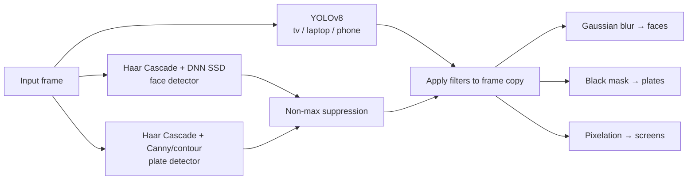
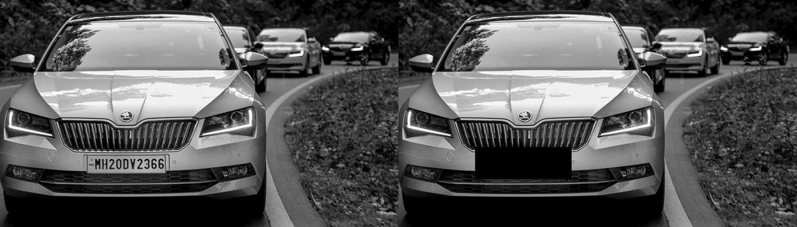
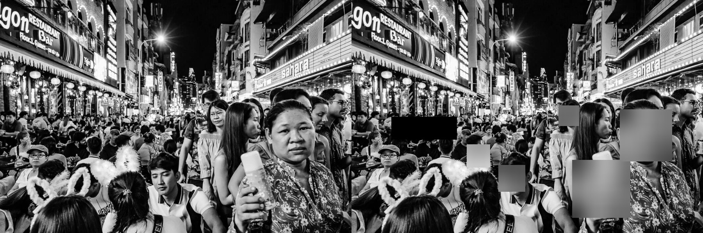

# Privacy Filter (Video)

A locally-run Python web app that finds sensitive visual information in **images and short videos** and anonymizes it automatically — no cloud APIs, no accounts, nothing ever leaves your machine.

It doesn't treat every detection the same way. It picks a filter based on *what* it found:

| Detected | Filter | Why |
|---|---|---|
| Human faces | Gaussian blur | Softens identity while keeping the photo looking natural, not like a redaction |
| License plates | Solid black mask | Plate text just needs to be unreadable — no need to preserve visual continuity |
| Screens / phones / laptops | Pixelation | Shows *there's a device* without leaking whatever's on the screen |

## How it works

Three independent detectors run **in parallel** (one `ThreadPoolExecutor`, three workers) on every frame:



- **Faces** are found two ways — a fast Haar Cascade and, if you drop the model files into `project/models/`, a more accurate DNN (SSD) detector — and the results are merged and deduplicated with non-max suppression.
- **Plates** likewise combine a Haar Cascade trained on plate shapes with classic contour detection (Canny edges → `findContours` → filter by aspect ratio), since neither alone catches everything.
- **Screens** use YOLOv8 (`yolov8n.pt`), filtered down to the `tv`/`laptop`/`cell phone` COCO classes.

All three run against the same frame at once, so total detection time is roughly the slowest single detector, not the sum of all three.

**Video** reuses the exact same per-frame pipeline (`process_frame()` in `detector.py`) — it just loops it over every frame of the clip with one shared thread pool, then re-encodes the result as MP4. Clips are capped at ~12 seconds and frames wider than 960px are downscaled, to keep processing time and page size reasonable for a demo app; there's no audio track in the output since OpenCV's video I/O is video-only.

Original files are never modified — every filter is applied to an in-memory copy, and uploaded/processed files are deleted from disk right after the response is sent.

## Results

**License plate → black mask**, run through `project/app.py`'s full pipeline:



**Face → blur, laptop → pixelation**, same image, two different filters chosen automatically by class:


**Crowd scene — 5 faces blurred**, and a useful example of a real failure mode: the solid black box on the sign in the background is a **false-positive plate detection** (a rectangular, high-contrast region the contour detector mistook for a plate). This is a known, documented limitation of the contour-based fallback, not a bug — see [Known Limitations](project/README.md#known-limitations).



## Quick start

```bash
cd project
pip install -r requirements.txt
python app.py
```

Then open `http://127.0.0.1:5000`, upload an image or short video, and download the filtered result.

Full setup (including the optional DNN face model), architecture notes, and the complete list of known limitations live in **[project/README.md](project/README.md)**.

## Repo layout

```
.
├── project/            ← the Flask app (see project/README.md)
├── docs/results/        ← before/after samples used above
├── images_CV_AAT/       ← sample test images
└── instructions.txt     ← original PRD / build spec
```


