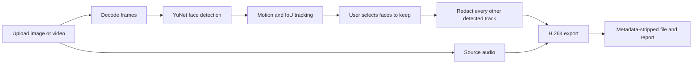

# Privacy Filter

A local-first image and video anonymizer. Upload footage, select the people who
may remain visible, and export a face-redacted H.264 video with audio kept or
muted. Processing stays on the machine running the app.

The project is designed as a computer-vision portfolio project: detector claims
are backed by reproducible evaluation scripts, privacy-sensitive choices fail
closed, and known limitations are documented.

## Current workflow



The selective-review pipeline:

- detects faces with OpenCV YuNet at the profile confidence threshold;
- assigns persistent, per-job track IDs;
- lets the user draw around one or more people to keep visible;
- hides every unselected detected face by default;
- supports manual hide regions for missed or difficult cases;
- applies redaction to the original-resolution frames;
- exports H.264 MP4 with the first audio stream kept or muted;
- strips source metadata and chapters; and
- produces a JSON or HTML redaction report without original pixels.

The original coursework pipeline remains at `/legacy` for comparison. It uses
Haar+DNN faces, Haar+contour plates and YOLOv8 screen detection. It is not the
default interface.

## Quick start

Requirements: Python 3.12 and FFmpeg with `libx264`.

```bash
python3.12 -m venv .venv
source .venv/bin/activate
pip install -r project/requirements.txt -r eval/requirements.txt
python scripts/download_yunet.py
python project/app.py
```

Open `http://127.0.0.1:5000/review`.

The YuNet model is downloaded into the git-ignored `project/models/` directory
and verified against a pinned SHA-256 checksum. The app does not download a
model while processing footage.

## How selection works

1. Upload an image or video and select Creator or Journalist.
2. Wait for local analysis to finish.
3. Pause on a clear frame and draw tightly around each face to keep visible.
4. Preview the result. Every other detected face remains hidden.
5. Inspect the clip, add manual hide regions if needed, then export.

A drawn rectangle is matched to one detected face track. It is not treated as
a stationary hole in the mask. Ambiguous and unmatched selections are rejected.
Tracking is motion-based, not identity recognition, so crossings and re-entry
must be reviewed.

## Profiles

| Setting | Creator | Journalist |
|---|---|---|
| Classes in the current UI | Faces only | Faces only |
| Face filter | Strong Gaussian blur | Solid fill |
| Box padding | 15% | 25% |
| Audio default | Keep | Mute |
| Metadata removal | Yes | Yes |
| Report | Yes | Yes |

Both profiles currently use YuNet at confidence `0.8`. Journalist mode changes
redaction strength, padding and audio behavior; it is not a guarantee that every
face will be detected.

## Measured face-detection results

The fixed evaluation set is a seeded 300-image WIDER FACE validation subset
containing 3,022 ground-truth boxes. Matching uses IoU ≥ 0.5. These are
detector-only CPU measurements, not end-to-end export speeds.

| Detector | Precision | Recall | Small recall | Medium recall | Large recall | FPS |
|---|--:|--:|--:|--:|--:|--:|
| Haar | 47.1% | 25.1% | 6.5% | 44.2% | 59.9% | 4.58 |
| SSD DNN | 98.1% | 11.8% | 0.0% | 13.1% | 74.0% | 65.48 |
| Haar+DNN legacy | 49.8% | 27.2% | 6.5% | 46.0% | 74.0% | 4.29 |
| YuNet 0.6 | 87.3% | 63.9% | 46.3% | 83.5% | 91.1% | 37.87 |
| **YuNet 0.8, review default** | **98.0%** | **47.9%** | **24.5%** | **73.4%** | **85.6%** | **39.18** |

At the current threshold, YuNet produced 29 false positives, compared with 828
for the legacy Haar+DNN path on the same images. The higher threshold was chosen
to address severe false boxes in interactive review, but its 47.9% recall means
missed small and occluded faces remain a material limitation.

Reproduce the results:

```bash
python eval/prepare_wider_face.py
python eval/run_baseline.py
python eval/compare_yunet.py
```

Local results are stored in `eval/results/baseline_local_arm64.csv` and
`eval/results/yunet_local_arm64.csv`. FPS was measured on arm64 macOS with
Python 3.12.14, OpenCV 4.14.0.94 and no GPU; performance will vary by machine.

## Privacy and safety behavior

- Missing track choices default to hidden.
- Every raw detection is included in that frame's redaction output. Tracking
  may add smoothing and gap-fill boxes but does not filter raw detections.
- The padded union of the raw and smoothed box is redacted, so smoothing cannot
  expose part of the current detection.
- Manual hide regions take precedence over keep-visible choices.
- The source upload is deleted after export, cancellation, error or expiry.
- Review jobs expire after 30 minutes of inactivity and active work has a
  one-hour limit.
- Source frames are decoded on demand and are not written as separate files.
- Model failures are surfaced instead of silently falling back to Haar.
- Flask defaults to debug off and binds only to `127.0.0.1`.

## Video behavior

- Frames stream one at a time; the entire video is never loaded into memory.
- Detection runs on a copy capped at 960 pixels wide; boxes are scaled back and
  filters are applied at full resolution.
- Rotation is read with `ffprobe` and applied explicitly.
- Frame timing is normalized to the measured average frame rate.
- Export uses H.264, `yuv420p` and `+faststart` for browser compatibility.
- The first audio stream is encoded to AAC when audio is kept.
- Source metadata, chapters and extra data streams are not copied.

The `/legacy` path also supports `MAX_CLIP_SECONDS`, `DETECTION_STRIDE` and
`PRIVACY_PROFILE`. A detection stride above 1 can expose a newly appearing
object for up to `K-1` frames; it is not used by the selective review path.

## Testing

```bash
python -m pytest -q
node --test tests/js/test_preview.cjs
```

Current result: **103 Python tests and 4 JavaScript tests pass**. The suite
covers metrics, tracking continuity, raw-box coverage, video streaming, audio,
rotation helpers, metadata removal, selection validation, session isolation,
cleanup and browser masking.

## Known limitations

- YuNet can miss small, profile, blurred or occluded faces. Review every frame.
- Track IDs are based on motion and overlap. Crossings, fast motion and re-entry
  can split or switch tracks.
- There is no measured frame-level or track-level leak rate yet because the
  required video ground truth has not been annotated.
- Variable frame timing is normalized rather than preserved exactly.
- Browser blur is an approximation; export uses the full-resolution OpenCV
  filter.
- Face redaction does not hide voice, clothing, gait, location or context.
- Real rotation-tagged phone footage still needs broader manual verification.
- The legacy plate detector remains noisy and is not enabled in the simplified
  face-only review interface.

## Models, data and licences

- **YuNet 2023mar weights:** MIT licence; fetched by
  `scripts/download_yunet.py`, revision and checksum pinned. Licence text is in
  `docs/YUNET_LICENSE.txt`.
- **WIDER FACE:** used only for local evaluation; dataset files are ignored and
  regenerated by `eval/prepare_wider_face.py`.
- **Legacy OpenCV SSD weights:** fetched only for baseline comparison. The
  upstream weights repository has no licence file, so the weights are not
  bundled or used by the current review pipeline.
- **Ultralytics YOLOv8:** used only by the legacy screen detector and subject to
  Ultralytics' AGPL terms.

Do not commit model weights, datasets or personal footage.

## Repository map

```text
project/app.py                 Flask entry point and legacy route
project/review_api.py          Session-owned review API
project/core/faces.py          YuNet adapter
project/core/tracking.py       IDs, smoothing, gap filling and padding
project/core/review.py         Analysis, preview, export and report
project/core/jobs.py           Background jobs, cancellation and expiry
project/core/selection.py      Fail-closed keep/hide validation
project/core/video.py          Video probing and legacy streaming utilities
project/static/review.js       Interactive review controller
project/static/preview.js      Browser masking renderer
eval/                          Reproducible metrics and saved results
tests/                         Python and JavaScript tests
docs/AUDIT.md                  Historical audit of the original coursework app
docs/HANDOFF.md                Current implementation handoff
PHASES.md                      Roadmap and completion status
```

## Next work

1. Annotate 5–10 short videos following `eval/video_gt/README.md`.
2. Measure frame-level and track-level leak rates.
3. Tune the precision/recall operating point from video evidence.
4. Replace and evaluate the legacy plate detector if plate support returns to
   the main review interface.
5. Add packaging, CI and a documented deployment path.
